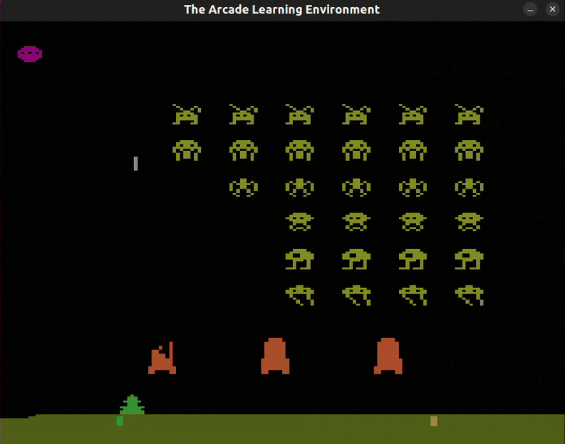

# LLM-Augmented Reinforcement Learning for Atari Space Invaders 👾

<p align="center">
  
  <br>
  <i>Agent trained with LLM-guided Q-Shaping successfully sniping a high-value UFO.</i>
</p>

This repository explores advanced Reinforcement Learning (RL) techniques to solve the **Atari Space Invaders** environment. The project focuses on two main research directions: **Reward Shaping** with PPO and **LLM-Guided Q-Shaping** using Google Gemini.

## 🚀 Key Research Components

### 1. PPO with Reward Shaping (Stable-Baselines3)
We utilize Proximal Policy Optimization (PPO) combined with a custom environment **Wrapper** to address the sparse reward problem and improve agent survival.
- **Penalty Logic:** Implementing significant penalties (up to `-5.0`) when the agent loses a life.
- **Incentive Logic:** Small auxiliary rewards for firing and strategic lateral movements.
- **Comparative Analysis:** A dedicated experimental script trains two models (Baseline vs. RS) and generates a comparative learning curve to visualize the impact of shaping on convergence.

### 2. LLM-Guided Q-Shaping (Q-Learning + Gemini)
A novel approach that integrates Large Language Models (LLMs) into the training loop of a population of 20 agents.
- **Dynamic Heuristic Generation:** Using **Google Gemini 2.5 Flash** to analyze the game's spatial grid and generate Python heuristic logic on-the-fly.
- **Q-Injection:** The LLM-generated logic identifies "Good" vs "Bad" actions for discovered states, injecting these biases directly into the Q-table to accelerate learning.
- **Mass-Shaping:** Automatically applying shaping rules across the entire agent population to optimize exploration.

### 3. Tetris Exploration (Work in Progress)
A baseline implementation for Tetris using PPO with frame stacking techniques.
- **State Representation:** Utilizing `VecFrameStack` (n=4) to provide the agent with temporal information, essential for understanding falling speeds and placement.
- **Current Status:** Basic training is implemented to establish a performance baseline. Further optimization via custom reward shaping (similar to the Space Invaders project) is planned to improve line-clearing efficiency.

---

## 📁 Project Structure
```text
.
├── spaceInvaders/
│   ├── ppo/
│   │   ├── ppo_rs_main.py         # PPO Training with Wrapper logic
│   │   └── ppo_comparison.py      # Script for comparative training & plotting
│   ├── q_learning/
│   │   ├── q_shaping_v3.py        # Gemini-guided population training
│   │   └── train.py               # Base Q-Learning & Discretized Wrapper
│   └── ppo_rs_comparison_v2.png   # Generated learning curve comparison chart
├── tetris/                        # RL experiments for Tetris environment
├── .gitignore                     # Configured for venv, logs, and weights
└── requirements.txt               # Project dependencies
```

---

## 🛠 Tech Stack
- **AI/RL:** Stable-Baselines3, PyTorch, Q-Learning.
- **LLM:** Google Gemini API (`google-generativeai`).
- **Environments:** Gymnasium Atari (ALE).
- **Analysis:** Matplotlib, NumPy, TQDM, Tensorboard.

---

## ⚙️ Setup & Installation

1. **Clone the repository:**
   ```bash
   git clone [https://github.com/minhdieuvu08/LLM-Augmented-RL.git](https://github.com/minhdieuvu08/LLM-Augmented-RL.git)
   cd Agents
   ```

2. **Setup Environment:**
   ```bash
   python3 -m venv agents_env
   source agents_env/bin/activate
   pip install -r requirements.txt
   ```

3. **Gemini API Key:** 
   To use the LLM-Guided scripts, ensure you have a valid API Key from [Google AI Studio](https://aistudio.google.com/).

---

## 📈 Methodology

### Reward Shaping Comparison
By running `ppo_comparison.py`, the system tracks the mean reward over a 100-episode window. The **Reward Shaping (RS)** model typically exhibits faster initial learning and more stable performance due to the survival-focused penalty system.

### LLM Q-Shaping Workflow
1. **Explore:** Agents perform an initial exploration to collect state-action data.
2. **Consult:** The system sends a grid representation to Gemini.
3. **Generate:** Gemini returns a Python function `heuristic_logic(grid_14x14)`.
4. **Inject:** The Q-values are adjusted based on the LLM's spatial reasoning, significantly reducing the "random walk" time.